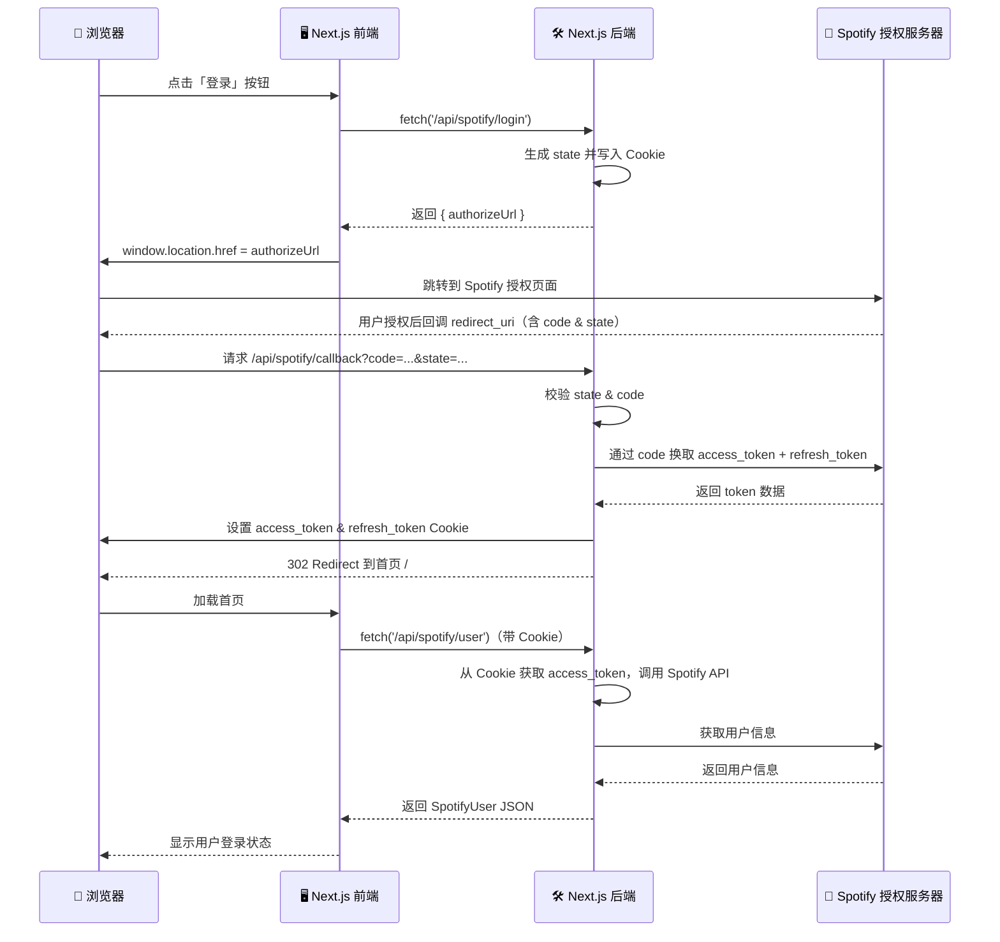

# spotify-openapi

## OAuth2 鉴权流程

```mermaid
sequenceDiagram
  participant UserBrowser as 🧑 浏览器
  participant Frontend as 🖥️ Next.js 前端
  participant Backend as 🛠️ Next.js 后端
  participant Spotify as 🎵 Spotify 授权服务器

  UserBrowser->>Frontend: 点击「登录」按钮
  Frontend->>Backend: fetch('/api/spotify/login')

  Backend->>Backend: 生成 state 并写入 Cookie
  Backend-->>Frontend: 返回 { authorizeUrl }

  Frontend->>UserBrowser: window.location.href = authorizeUrl
  UserBrowser->>Spotify: 跳转到 Spotify 授权页面

  Spotify-->>UserBrowser: 用户授权后回调 redirect_uri（含 code & state）
  UserBrowser->>Backend: 请求 /api/spotify/callback?code=...&state=...

  Backend->>Backend: 校验 state & code
  Backend->>Spotify: 通过 code 换取 access_token + refresh_token
  Spotify-->>Backend: 返回 token 数据

  Backend->>UserBrowser: 设置 access_token & refresh_token Cookie
  Backend-->>UserBrowser: 302 Redirect 到首页 /

  UserBrowser->>Frontend: 加载首页
  Frontend->>Backend: fetch('/api/spotify/user')（带 Cookie）
  Backend->>Backend: 从 Cookie 获取 access_token，调用 Spotify API
  Backend->>Spotify: 获取用户信息
  Spotify-->>Backend: 返回用户信息
  Backend-->>Frontend: 返回 SpotifyUser JSON
  Frontend-->>UserBrowser: 显示用户登录状态

```
